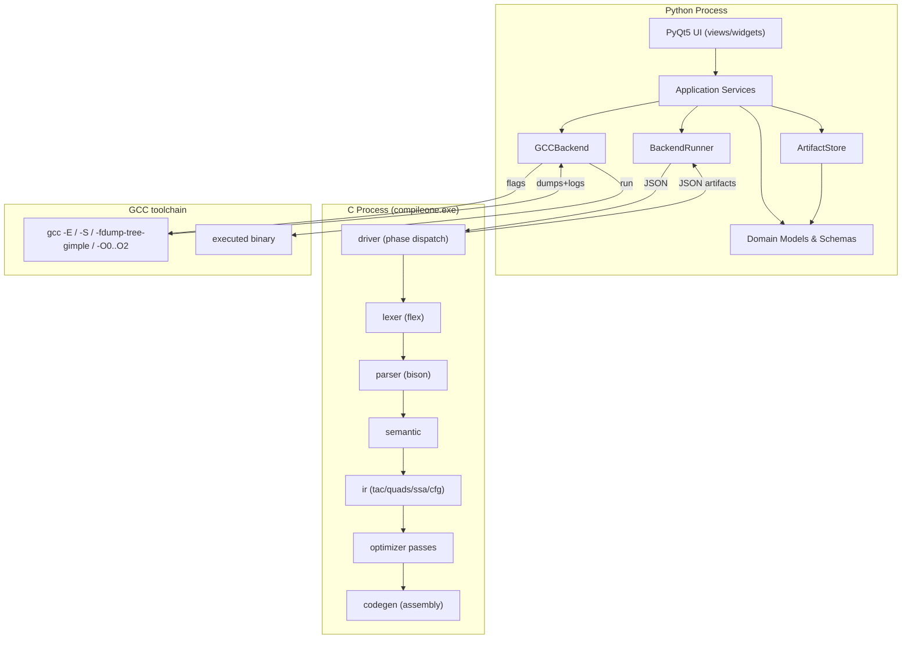
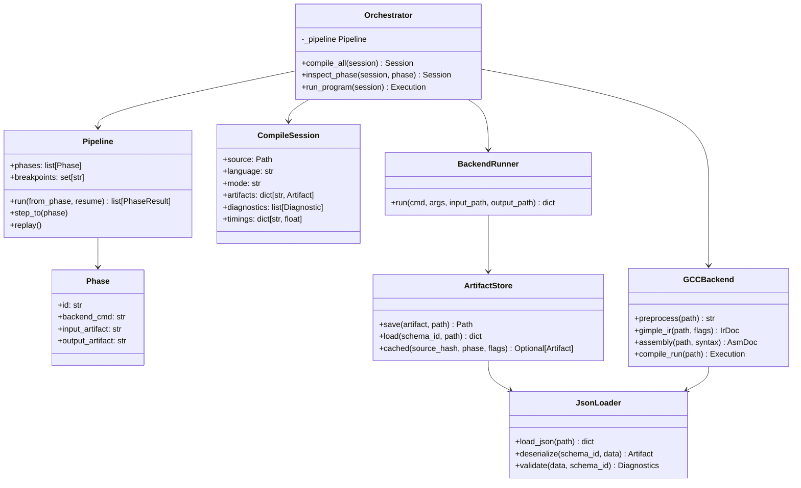
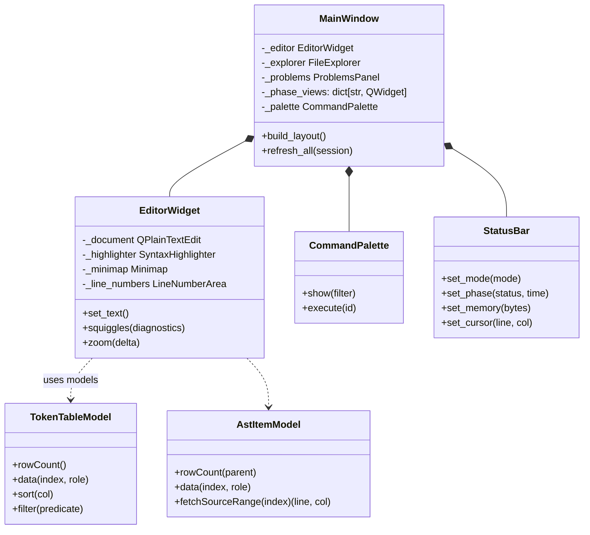
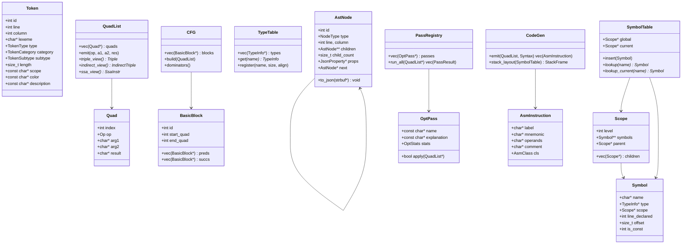
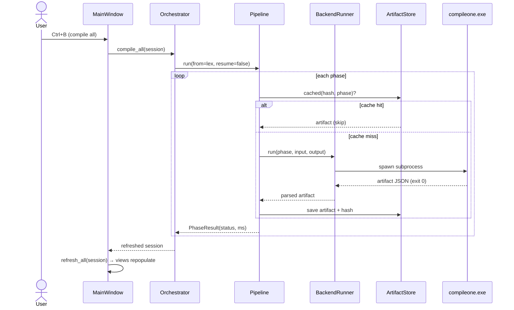

# CompileOne — Master Architecture & Design Document

> **Version:** 1.0 (Design Phase — pending approval)
> **Author:** CompileOne Architecture Board
> **Status:** Proposal for review. No implementation code produced from this document until approved.
> **Scope:** Complete redesign of the CompileOne educational compiler IDE.

---

## Table of Contents

1. [Executive Summary](#1-executive-summary)
2. [Constraints & Ground Truth](#2-constraints--ground-truth)
3. [The Central Architectural Decision: Dual-Mode Pipeline](#3-the-central-architectural-decision-dual-mode-pipeline)
4. [Complete Architecture](#4-complete-architecture)
5. [Folder Structure](#5-folder-structure)
6. [Module Responsibilities](#6-module-responsibilities)
7. [Class Diagrams](#7-class-diagrams)
8. [Data Flow](#8-data-flow)
9. [JSON Communication Schemas](#9-json-communication-schemas)
10. [Backend Architecture](#10-backend-architecture)
11. [Frontend Architecture](#11-frontend-architecture)
12. [UI Wireframes](#12-ui-wireframes)
13. [Visualization Catalog](#13-visualization-catalog)
14. [Feature Traceability Matrix](#14-feature-traceability-matrix)
15. [Implementation Roadmap](#15-implementation-roadmap)
16. [Risk Register](#16-risk-register)
17. [Coding Standards](#17-coding-standards)
18. [Documentation & Deliverables Plan](#18-documentation--deliverables-plan)

---

## 1. Executive Summary

CompileOne will be rebuilt as a **clean-architecture, dual-mode, educational compiler IDE**:

- **A Python orchestration layer** (PyQt5) renders everything; it **never** performs compiler analysis on source text. It only *drives* real backend tools and *visualizes verified structured output* (JSON).
- **A C/Flex/Bison compiler backend** ("Study Mode") implements the complete classic compiler pipeline for a small, pedagogically-designed language — emitting real structured JSON at **every** phase.
- **A GCC/G++ real-compiler bridge** ("Real Mode") runs genuine GCC dumps (`-E`, GIMPLE IR, `-S`, optimized vs. unoptimized, native execution) and converts *real compiler output* into structured JSON for visualization.
- **JSON is the single source of truth** between every phase and between backend and UI.

The current project ships a tkinter GUI that **fakes all six phases with regular expressions** (`gui.py:255`). That is the primary defect this redesign eliminates. The existing Flex/Bison AST, symbol table, semantic, and TAC code is salvageable as the core of the new Study-Mode backend, but must be rebuilt to emit JSON and communicate through a pipeline driver.

### Design Principles

| Principle | Application |
|---|---|
| Clean Architecture | Presentation → Application → Domain → Infrastructure. Dependency rule enforced. |
| No regex compilers | Python never tokenizes/parses source. Only GCC dumps are parsed (structured text) by the backend bridge. |
| JSON everywhere | Every phase emits a validated JSON artifact consumed by the next phase and by the UI. |
| One responsibility per module | Each folder = one concern. No cross-layer imports from UI into backend. |
| Educational honesty | Every view is labeled with the real tool that produced it ("GCC 6.3 GIMPLE dump", "Flex 2.6.4 token stream"). |
| Incremental delivery | Backend first (with golden tests), then UI per phase. See Roadmap. |

---

## 2. Constraints & Ground Truth

Detected environment (Windows, MinGW):

| Capability | Value | Design consequence |
|---|---|---|
| Python | 3.13.13 | Type-hinted modern codebase, `dataclasses`, `pathlib`. |
| gcc/g++ | MinGW.org **GCC 6.3.0** | Supports `-E`, `-S`, `-fdump-tree-gimple`, `-fopt-info`, DWARF `-g`. No `-fdump-tree-...=ssa` limits beyond 6.3; still fine. |
| flex | 2.6.4 | Study-mode lexer generator. |
| bison | **2.4.2** | Older Bison: no `%define api.value.type`, use `%union` + `%type`. Modern-ish grammar still possible. |
| make | available | Backend build orchestration. |
| clang / LLVM | **not installed** | Real-mode tokens/AST-JSON via Clang deferred to "Future" milestone. Not a blocker. |
| PyQt5 5.15.11 | installed & importable | **Chosen UI framework** (see §11). |
| PySide6 | not installed | Alternative; requires `pip install`. |
| CustomTkinter / ttkbootstrap | installed | Rejected as primary (cannot deliver minimap/folding/docking/data-grids) — see §11. |
| QScintilla | not installed | Optional editor upgrade; fallback is QPlainTextEdit + QSyntaxHighlighter. |
| numpy 2.2.4 | installed | Used for performance/telemetry charts and CFG layout only. |

---

## 3. The Central Architectural Decision: Dual-Mode Pipeline

There is a genuine tension in the mission: *C/C++ programs*, *Flex+Bison front-end*, and *every phase must be a real compiler phase*. Flex/Bison cannot parse real C++. GCC does not emit tokens or an AST JSON dump. The only honest resolution is **two complementary modes** sharing one UI and one JSON contract.

### Mode A — Study Mode (`mini-c`, extension `.mc`)

A purpose-built educational language (evolution of today's `.mc`) compiled by **our own Flex+Bison+C backend**.

- Full control over every phase → real tokens, real parse tree, real AST, real semantic analysis, real IR (TAC/quads/triples/SSA/CFG), real optimization passes, real assembly emission.
- This is the **compiler-construction classroom**: students can step through, replay, and inspect phases a real compiler never exposes cleanly.
- Will be extended with functions, arrays, `for`, `while`, `if/else`, type system, and error recovery to make it a rich teaching language.

### Mode B — Real Mode (`c`, `cpp`)

A bridge to the **real GCC toolchain**. Only genuinely-real compiler artifacts are shown, each labeled with its producing command:

| Real artifact | GCC command | What we show |
|---|---|---|
| Preprocessed source | `gcc -E` | Preprocessor phase output |
| Real IR (SSA) | `gcc -fdump-tree-gimple` | GIMPLE IR with SSA form, basic blocks, CFG |
| Optimization evidence | `gcc -O0 -S` vs `gcc -O2 -S` + `-fopt-info` | Real before/after instruction counts, GCC's own pass logs |
| Assembly | `gcc -S` (AT&T / Intel via `-masm=intel`) | Real assembly, syntax highlighted, annotated |
| Semantic evidence | GCC diagnostics | Real errors/warnings with `-fdiagnostics-format=json`-style extraction (parsed from `-Wall -Wextra` output) |
| Execution | run the produced binary | stdout/stderr/exit code/time/binary size |

**Honest labeling is mandatory.** In Real Mode the token stream and AST are *not* available (GCC doesn't expose them); the UI must present exactly what GCC genuinely produces. Clang (future) adds `-dump-tokens` and `-ast-dump=json` later.

### Recommendation

Implement **Study Mode first** (Phases A–G): it is fully within our control, teaches the entire pipeline, and reuses the existing C code. Then implement the GCC bridge (Phase H). Both modes share the same artifact JSON schemas so views are written once.

---

## 4. Complete Architecture

### 4.1 Layered Architecture

```
┌───────────────────────────────────────────────────────────────────────┐
│  PRESENTATION (Python / PyQt5) — UI, views, widgets, dialogs          │
│  MainWindow · Editor · TokenGrid · ASTTree · SymbolView · IRView ·    │
│  AssemblyView · GraphView · Problems · Terminal · Output · Console ·  │
│  CompilerPanel · Inspector · PerfMonitor · Palette · Breadcrumb       │
│  ─────── does NOT spawn processes, does NOT parse source ──────────   │
├───────────────────────────────────────────────────────────────────────┤
│  APPLICATION (Python) — use cases, orchestration, services            │
│  Orchestrator · Pipeline · Workspace · Commands · BackendRunner ·     │
│  ArtifactStore · GCCBackend · ExportService · ReportService ·         │
│  Settings · Theme · Logging · Telemetry                               │
│  ─────── owns subprocess calls, JSON I/O, threading, caching ──────   │
├───────────────────────────────────────────────────────────────────────┤
│  DOMAIN (Python) — pure models, no I/O                                │
│  Artifacts (dataclasses) · Diagnostics · JSON Schema models ·         │
│  Education catalog (phase theory)                                     │
│  ─────── knows about JSON schemas, knows nothing about Qt or gcc ───  │
├───────────────────────────────────────────────────────────────────────┤
│  INFRASTRUCTURE / BACKEND (C · Flex · Bison · GCC · Make)             │
│  compileone.exe driver → lex · parse · semantic · ir · opt ·          │
│  codegen · run  +  gcc bridge                                          │
│  ─────── emits validated JSON artifacts; reads JSON artifacts ──────  │
└───────────────────────────────────────────────────────────────────────┘
```

**Dependency rule:** `Presentation → Application → Domain`. `Domain` imports nothing external. `Infrastructure` is *below* everything conceptually — the Application talks to it only through `BackendRunner`/`GCCBackend` (dependency injection). The backend never depends on Python. The only shared contract is the JSON schemas in `app/domain/schemas/`.

### 4.2 Component Diagram



### 4.3 Threading & Performance Model

- `Pipeline` runs each phase in a `QThreadPool` worker; UI stays responsive; each phase has a cancellable task.
- Artifacts are cached by `(source_hash, language, phase, flags)` in `Temp/cache/`. Re-running only recomputes changed phases (incremental compilation).
- Large structures (AST, token lists) are **lazy**: Qt models fetch children on expansion only.
- Telemetry records per-phase duration, memory delta, artifact byte size.

---

## 5. Folder Structure

```
CompileOne/
├── app/                                  # PYTHON APPLICATION (presentation + app + domain)
│   ├── __init__.py
│   ├── main.py                           # Entry point: QApplication + MainWindow bootstrap
│   ├── application/                      # Use cases & orchestration
│   │   ├── orchestrator.py               #   High-level flows: compile_all, inspect_phase, run_program
│   │   ├── pipeline.py                   #   Ordered phase definitions, breakpoints, step/replay
│   │   ├── compile_session.py            #   One (source → artifacts → views) session
│   │   ├── workspace.py                  #   Files, tabs, recent, language detection
│   │   └── commands.py                   #   Command-palette registry (Ctrl+Shift+P)
│   ├── domain/                           # Pure models — no I/O, no Qt
│   │   ├── artifacts.py                  #   Dataclasses: TokenStream, AstDoc, SemanticInfo, IrDoc, OptDoc, AsmDoc, Execution
│   │   ├── diagnostics.py                #   Diagnostic (error/warning/info) model
│   │   ├── schemas/                      #   JSON Schemas — SINGLE SOURCE OF TRUTH
│   │   │   ├── token_stream.json
│   │   │   ├── parse_tree.json
│   │   │   ├── ast.json
│   │   │   ├── semantic.json
│   │   │   ├── ir.json
│   │   │   ├── optimization.json
│   │   │   ├── assembly.json
│   │   │   └── execution.json
│   │   └── education/                    #   Theory catalog: per-phase explanations, pass rationale
│   │       ├── phases.py
│   │       └── passes.py
│   ├── infrastructure/                   # I/O, subprocess, tool bridges
│   │   ├── backend_runner.py             #   Spawns compileone.exe subcommands, captures JSON
│   │   ├── gcc_backend.py                #   Runs real GCC dumps & parses them into artifacts
│   │   ├── artifact_store.py             #   Reads/writes Output/*.json with validation
│   │   ├── json_loader.py                #   JSON → dataclass (validated) deserializer
│   │   └── tool_detector.py              #   Discovers gcc/g++/flex/bison/clang versions
│   ├── services/                         # Cross-cutting services
│   │   ├── settings_service.py           #   Persistent settings (QSettings) + DI container
│   │   ├── theme_service.py              #   VS Code Dark QSS + syntax theme + icon theme
│   │   ├── logging_service.py            #   Structured logging to Console + file
│   │   ├── export_service.py             #   PDF / HTML / MD / JSON / CSV / PNG / SVG reports
│   │   ├── report_service.py             #   Assembled "Compiler Report" documents
│   │   └── telemetry.py                  #   Perf/memory/compile-time monitor + charts
│   └── ui/                               # PyQt5 presentation layer
│       ├── main_window.py                #   Dockable main window (VS Code layout)
│       ├── editor/                       #   Code editor
│       │   ├── editor_widget.py          #   QScintilla (optional) / QPlainTextEdit core
│       │   ├── syntax.py                 #   QSyntaxHighlighter definitions
│       │   ├── line_number_area.py
│       │   ├── minimap.py                #   Thumbnail render widget
│       │   ├── folding.py                #   Fold regions (QScintilla) or margin emulation
│       │   └── completions.py            #   Autocomplete provider
│       ├── views/                        #   Phase panels
│       │   ├── token_table_view.py       #   Sortable/filterable token data grid
│       │   ├── parse_tree_view.py
│       │   ├── ast_tree_view.py          #   Expand/collapse, icons, jump-to-source
│       │   ├── symbol_table_view.py
│       │   ├── scope_tree_view.py
│       │   ├── type_table_view.py
│       │   ├── ir_view.py                #   TAC/quad/triple/SSA tabbed comparison
│       │   ├── cfg_view.py               #   Basic-block CFG graph
│       │   ├── optimization_view.py      #   Before/after + pass explanations
│       │   ├── assembly_view.py          #   Highlighted assembly + stack layout
│       │   ├── graph_view.py             #   Generic graph renderer (QGraphicsScene)
│       │   └── execution_view.py         #   stdout/stderr/exit/time/size
│       ├── panels/                       #   Container panels
│       │   ├── file_explorer.py
│       │   ├── outline.py                #   Symbols outline
│       │   ├── problems.py               #   Errors/Warnings squiggle list
│       │   ├── output.py                 #   Compiler text output
│       │   ├── terminal.py               #   Executable terminal
│       │   ├── compiler.py               #   Phase-by-phase pipeline monitor
│       │   ├── inspector.py              #   JSON viewer for any artifact
│       │   ├── console.py                #   IDE console (logging)
│       │   └── performance.py            #   Perf monitor charts
│       ├── widgets/                      #   Reusable widgets
│       │   ├── command_palette.py        #   Ctrl+Shift+P overlay
│       │   ├── breadcrumbs.py            #   Navigation path
│       │   ├── status_bar.py             #   Multi-slot status
│       │   ├── minimap_widget.py
│       │   └── json_tree.py              #   Generic JSON tree widget
│       ├── models/                       #   Qt item models (QAbstractItemModel subclasses)
│       │   ├── token_model.py
│       │   ├── ast_model.py
│       │   ├── symbol_model.py
│       │   ├── scope_model.py
│       │   ├── ir_model.py
│       │   ├── problems_model.py
│       │   └── outline_model.py
│       └── theme/                        #   QSS stylesheets + color schemes
│           ├── vs_dark.qss
│           ├── colors.py
│           └── icons.py                  #   SVG icon loader
├── backend/                              # C / FLEX / BISON BACKEND
│   ├── include/                          # Shared public headers
│   │   ├── compileone.h                  #   Driver entry, common types, phase registry
│   │   ├── json.h                        #   JSON write/parse API (vendored lib wrapper)
│   │   └── artifact.h                    #   Artifact envelope struct (schema id, phase, source)
│   ├── src/
│   │   ├── driver/compileone.c           #   main(): subcommand dispatch, --input/--output/--resume
│   │   ├── lexer/lexer.l                 #   Flex spec (study language)
│   │   ├── lexer/token.c token.h         #   Token struct + JSON serializer
│   │   ├── parser/parser.y               #   Bison grammar → parse tree
│   │   ├── parser/parse_tree.c .h        #   Parse tree nodes + JSON serializer
│   │   ├── ast/ast.c ast.h               #   AST build, node ids, source locations
│   │   ├── ast/ast_json.c                #   AST → JSON and JSON → AST (resume support)
│   │   ├── semantic/semantic.c .h        #   Semantic analyzer (typecheck, const-assign, etc.)
│   │   ├── symbol_table/symbol_table.c .h#   Scope chain, symbols, types
│   │   ├── symbol_table/layout.c         #   Memory layout, offsets, stack frame sizes
│   │   ├── ir/tac.c                      #   Three-address code emitter
│   │   ├── ir/quad.c                     #   Quadruple / triple / indirect-triple views
│   │   ├── ir/ssa.c                      #   SSA construction (dominance-based)
│   │   ├── ir/cfg.c                      #   Basic blocks + CFG builder
│   │   ├── optimize/passes.c             #   Pass registry: fold, DCE, CSE, LICM, ...
│   │   ├── optimize/constant.c           #   folding/propagation
│   │   ├── optimize/dce.c                #   dead code + unreachable removal
│   │   ├── optimize/cse.c                #   common subexpression elimination
│   │   ├── optimize/licm.c               #   loop invariant code motion
│   │   ├── optimize/strength.c           #   strength reduction
│   │   ├── optimize/peephole.c           #   peephole
│   │   ├── optimize/algebraic.c          #   algebraic simplification
│   │   ├── codegen/codegen.c .h          #   x86/x86_64 AT&T + Intel emission
│   │   ├── codegen/stack.c               #   stack layout, prologue/epilogue
│   │   ├── runner/runner.c               #   invoke gcc/g++, run binary, capture metrics
│   │   ├── json/                          #   small vendored JSON library (see §10)
│   │   │   ├── jsmn.h  (or json-c)
│   │   │   └── json_writer.c
│   │   └── util/
│   │       ├── strbuf.c .h               #   growable string buffer
│   │       ├── darray.c .h               #   typed dynamic arrays / vectors
│   │       ├── color.c .h                #   token category → color mapping (shared lexicon)
│   │       └── diag.c .h                 #   diagnostic collection (errors/warnings JSON)
│   ├── third_party/                      #   vendored single-header libs (license headers kept)
│   └── build/                            #   Makefile output (objects/binaries)
├── docs/                                 # DOCUMENTATION
│   ├── DESIGN.md                         #   This document
│   ├── architecture.md                   #   Diagrams (Mermaid/PNG) + rationale
│   ├── class-diagrams.md
│   ├── sequence-diagrams.md
│   ├── pipeline.md                       #   Compiler pipeline diagram + per-phase theory
│   ├── api.md                            #   JSON schemas + CLI contract + Python API
│   ├── developer-guide.md
│   ├── student-guide.md
│   └── diagrams/                         #   Export targets (png/svg)
├── resources/
│   ├── fonts/                            #   JetBrains Mono, Consolas, Segoe UI Variable
│   ├── icons/                            #   SVG icons (activity bar, phases, passes)
│   └── themes/                           #   .tmTheme/.json color schemes
├── examples/
│   ├── study/                            #   .mc study programs (fib, scopes, arrays...)
│   └── real/                             #   .c / .cpp programs for GCC mode
├── tests/
│   ├── backend/                          #   C test drivers (golden JSON comparison)
│   │   ├── test_lexer.c
│   │   ├── test_parser.c
│   │   ├── test_semantic.c
│   │   ├── test_ir.c
│   │   ├── test_opt.c
│   │   └── test_codegen.c
│   ├── frontend/                         #   pytest: services, models, export, orchestration
│   │   ├── test_pipeline.py
│   │   ├── test_artifact_store.py
│   │   ├── test_json_loader.py
│   │   └── test_export.py
│   ├── integration/                      #   End-to-end: source → artifacts → UI models
│   └── data/                             #   fixtures + golden outputs
│       ├── fixtures/                     #   input .mc / .c files
│       └── golden/                       #   expected JSON artifacts
├── Output/                               # RUNTIME artifacts (gitignored)
│   ├── tokens.json · parse_tree.json · ast.json · semantic.json
│   ├── ir.json · optimization.json · assembly.json · execution.json
│   └── cache/                            #   incremental-compile cache
├── Temp/                                 # RUNTIME temp (gitignored)
├── Build/                                # BUILD OUTPUT (gitignored) — compileone.exe etc.
├── .gitignore
├── Makefile                              # build backend, test, gui, clean
└── README.md                             # Project overview + quickstart
```

### Why every folder exists (one-line rationale)

| Folder | Why it exists |
|---|---|
| `app/` | All Python code in one tree, split by clean-architecture layer so UI never leaks into backend logic. |
| `app/application/` | Orchestration use-cases; the only layer allowed to know about both UI and backend. |
| `app/domain/` | The JSON contract + pure models; shared truth that keeps backend and UI honest. |
| `app/domain/schemas/` | Versioned JSON schemas — the one file a backend writer must obey and a UI writer must render. |
| `app/infrastructure/` | Everything that touches processes/files/tools; easily mocked in tests. |
| `app/services/` | Cross-cutting concerns (settings, theme, logging, export) reused by every use-case. |
| `app/ui/` | PyQt5 widgets, views, panels, item models. Purely presentational. |
| `backend/` | The C compiler; kept completely separate from Python so it can be built with plain Make. |
| `backend/src/driver/` | Single entry point for all phase subcommands; enables step/replay/breakpoints. |
| `backend/src/ir/`, `optimize/`, `codegen/` | One directory per compiler phase — SOLID single-responsibility. |
| `docs/` | The educational + engineering documentation suite. |
| `resources/` | Non-code assets: fonts, icons, themes. |
| `examples/` | Curated teaching programs, split by mode. |
| `tests/` | Golden-JSON tests for backend, pytest for Python, end-to-end integration. |
| `Output/`, `Temp/`, `Build/` | Explicit runtime separation: artifacts (reusable), scratch, binaries — all gitignored. |

---

## 6. Module Responsibilities

### 6.1 Python — Application Layer

| Module | Responsibilities | Knows about |
|---|---|---|
| `orchestrator.py` | `compile_all(session)`, `inspect_phase(session, name)`, `run_program(session)`; wires services; returns updated `CompileSession` | Pipeline, services, session |
| `pipeline.py` | Ordered `Phase` list per mode; breakpoints; step/replay state machine; per-phase timing | BackendRunner, artifact schema ids |
| `compile_session.py` | One compilation: source path, language, mode, per-phase status, artifact paths, diagnostics | Domain models |
| `workspace.py` | Open/save files, tabs, recent list, language & mode detection by extension | Settings |
| `commands.py` | Command palette registry (id → callable + args); keyboard shortcut map | Orchestrator |

### 6.2 Python — Infrastructure Layer

| Module | Responsibilities |
|---|---|
| `backend_runner.py` | Spawn `compileone.exe <phase> --input <file> --output <path> --flags ...`; validate exit; return artifact dict. Injection point for tests (fake runner). |
| `gcc_backend.py` | Runs GCC commands, parses dumps/logs into artifacts (the **only** parser of *real compiler output*, never of user source as analysis). |
| `artifact_store.py` | Persist/load/validate artifacts; cache lookup by `(source_hash, phase, flags)`; incremental reuse. |
| `json_loader.py` | Schema-aware deserialization to dataclasses; raises structured validation errors surfaced as IDE diagnostics. |
| `tool_detector.py` | Probe versions of gcc/g++/flex/bison/clang/llvm; populate Settings + status bar. |

### 6.3 Python — Services

| Module | Responsibilities |
|---|---|
| `settings_service.py` | QSettings-backed persistence; DI container exposing singletons (theme, tools, paths). |
| `theme_service.py` | Applies `vs_dark.qss`, token color palette, icon theme; supports light fallback. |
| `logging_service.py` | Structured log records → Console panel + `Temp/logs/`; levels per subsystem. |
| `export_service.py` | Render artifacts to PDF/HTML/MD/JSON/CSV/PNG/SVG (QTextDocument + QPainter for PDF/PNG/SVG). |
| `report_service.py` | Assemble multi-artifact "Compiler Report" (cover, pipeline summary, per-phase sections). |
| `telemetry.py` | Wall-clock per phase, RAM delta (psutil if available, else ctypes GetProcessMemoryInfo), artifact sizes; charts. |

### 6.4 Python — Domain

| Module | Responsibilities |
|---|---|
| `artifacts.py` | Typed containers mirroring schemas: `TokenStream`, `ParseTree`, `AstDoc`, `SemanticInfo`, `IrDoc`, `OptDoc`, `AsmDoc`, `Execution`. |
| `diagnostics.py` | `Diagnostic(kind, code, message, line, column, end_line, end_col, phase, source)`; severity sort; squiggle mapping. |
| `education/phases.py` | Human theory per phase (goal, inputs, outputs, classic algorithms, pitfalls). |
| `education/passes.py` | Per-pass: what changes, why, expected perf impact, instruction reduction formula. |

### 6.5 Backend — C Modules

| Module | Responsibilities |
|---|---|
| `driver/compileone.c` | Parse `argv`; dispatch to phase handler; load prior artifact JSON when resuming; write artifact envelope. |
| `lexer/` | Flex scanner → `Token` list; emit `token_stream.json`. Keeps line/col/lexeme/token-id/length/scope/category/color/description. |
| `parser/` | Bison grammar → parse tree (every reduction = a node with production name); then AST builder. Emits `parse_tree.json` + `ast.json`. |
| `ast/` | Node struct with `id`, `type`, `line/col`, children list, properties; JSON serialization + deserialization (resume). |
| `semantic/` | Symbol table (scope chain), type table, scope tree, memory layout, reference graph, diagnostics. |
| `symbol_table/` | Scope stack, symbol insertion/lookup, redeclaration detection. `layout.c` assigns offsets/sizes. |
| `ir/` | TAC emitter; quadruple/triple/indirect-triple views over same instruction list; SSA builder; CFG/basic-blocks. |
| `optimize/` | Pass framework: run pass, record before/after instruction lists + explanation strings + metrics. |
| `codegen/` | x86/x86_64 emission, AT&T + Intel; instruction classification (reg/imm/mem/label/comment) for highlighting. |
| `runner/` | gcc/g++ invocation, binary run, captures stdout/stderr/exit/time/size. |
| `json/` | Small vendored JSON parser + writer (see §10). |
| `util/` | strbuf, darray, color lexicon (token→color shared with UI), diagnostics collection. |

---

## 7. Class Diagrams

### 7.1 Python — Core (Mermaid)



### 7.2 Python — UI (Mermaid)



### 7.3 Backend — C (Mermaid)



---

## 8. Data Flow

### 8.1 Study-Mode Pipeline Data Flow

```
 source.mc
    │  (write)
    ▼
┌─ Pipeline (Python) ──────────────────────────────────────────────┐
│  Phase 1  lex      compileone.exe lex  ──▶ Output/tokens.json      │
│  Phase 2  parse    compileone.exe parse ─▶ Output/parse_tree.json  │
│  Phase 3  ast      compileone.exe ast   ─▶ Output/ast.json         │
│  Phase 4  semantic compileone.exe sem   ─▶ Output/semantic.json    │
│  Phase 5  ir       compileone.exe ir    ─▶ Output/ir.json          │
│  Phase 6  opt      compileone.exe opt   ─▶ Output/optimization.json│
│  Phase 7  codegen  compileone.exe asm   ─▶ Output/assembly.json    │
│  Phase 8  run      compileone.exe run   ─▶ Output/execution.json   │
└───────────────────────────────────────────────────────────────────┘
      every phase: --input <prev.json> --output <next.json>  (+ --resume)
                    + --input <source.mc> for phase 1
      breakpoints: Pipeline halts after a phase if breakpoint set
```

Each arrow is a real `compileone.exe` subprocess call, so **step-by-step, replay, breakpoints, and per-phase re-run are trivial**: the driver re-reads the prior artifact JSON and resumes.

### 8.2 Real-Mode (GCC) Data Flow

```
 source.c/cpp
    │
    ▼
 GCCBackend
    ├─ gcc -E -dD -P        ──▶ preprocessed source   (view: Preprocessor)
    ├─ gcc -Wall -Wextra -c  ─▶ diagnostics            (view: Problems)
    ├─ gcc -fdump-tree-gimple-raw -O0 │ -O2 ─▶ GIMPLE  (view: IR / SSA / CFG)
    ├─ gcc -S -masm=att|intel -O0 │ -O2 ─▶ .s         (view: Assembly, before/after)
    ├─ gcc -fopt-info-optimized -O2 ─▶ pass log       (view: Optimization evidence)
    └─ gcc ... -o prog && run prog ─▶ stdout/stderr/exit/time/size (view: Execution)
```

### 8.3 Sequence Diagram — "Compile All" Use Case



---

## 9. JSON Communication Schemas

All artifacts share an **envelope**:

```jsonc
{
  "schema": "compileone/token-stream/1.0",
  "phase": "lexical",
  "language": "mini-c",
  "source_file": "examples/study/fib.mc",
  "generated_by": "compileone.exe v0.1 (flex 2.6.4)",
  "duration_ms": 1.2,
  "artifacts": { ... phase-specific ... }
}
```

### 9.1 `token_stream.json`

```jsonc
{
  "schema": "compileone/token-stream/1.0",
  "phase": "lexical",
  "language": "mini-c",
  "source_file": "examples/study/fib.mc",
  "generated_by": "compileone.exe (flex 2.6.4)",
  "duration_ms": 0.9,
  "tokens": [
    {
      "id": 1,
      "line": 1, "column": 1,
      "lexeme": "int",
      "token": "KW_INT",
      "category": "keyword",
      "subtype": "type-specifier",
      "length": 3,
      "scope": "global",
      "color": "#569cd6",
      "description": "32-bit signed integer type specifier",
      "offset": { "start": 0, "end": 3 }
    }
  ],
  "statistics": { "total": 42, "by_category": { "keyword": 7, "identifier": 9 } },
  "errors": []
}
```

### 9.2 `parse_tree.json`

```jsonc
{
  "schema": "compileone/parse-tree/1.0",
  "phase": "syntax",
  "root": {
    "id": "p1",
    "production": "program : stmt_list",
    "children": [
      {
        "id": "p2",
        "production": "var_decl : KW_INT IDENTIFIER SEMICOLON",
        "line": 1, "column": 1,
        "children": [
          { "id": "p3", "token": "KW_INT", "lexeme": "int" },
          { "id": "p4", "token": "IDENTIFIER", "lexeme": "x" },
          { "id": "p5", "token": "SEMICOLON", "lexeme": ";" }
        ]
      }
    ]
  }
}
```

### 9.3 `ast.json`

```jsonc
{
  "schema": "compileone/ast/1.0",
  "phase": "ast",
  "root_id": "n1",
  "nodes": {
    "n1": { "id": "n1", "type": "VarDecl", "kind": "statement",
            "line": 1, "column": 1, "source_text": "int x;",
            "children": ["n2"], "properties": { "type_name": "int" } },
    "n2": { "id": "n2", "type": "IdRef", "kind": "expression",
            "line": 1, "column": 5, "source_text": "x", "properties": {} }
  },
  "source_map": { "n1": "1:1", "n2": "1:5" }
}
```

### 9.4 `semantic.json`

```jsonc
{
  "schema": "compileone/semantic/1.0",
  "phase": "semantic",
  "symbols": [
    { "name": "x", "type": "int", "scope_id": "s0", "line_declared": 1,
      "is_const": false, "offset": 0, "size": 4 }
  ],
  "scopes": [
    { "id": "s0", "level": 0, "parent": null, "kind": "global" },
    { "id": "s1", "level": 1, "parent": "s0", "kind": "block", "line": 7 }
  ],
  "types": [ { "name": "int", "size": 4, "align": 4 }, { "name": "bool", "size": 1, "align": 1 } ],
  "memory": { "total_frame_bytes": 12, "layout": [
      { "name": "x", "offset": 0, "size": 4 }, { "name": "y", "offset": 4, "size": 4 }
  ]},
  "references": [
    { "from": "n3", "to": "n2", "kind": "use", "symbol": "x", "line": 4 }
  ],
  "diagnostics": [
    { "severity": "error", "code": "E1001", "message": "Undeclared variable 'y'",
      "line": 7, "column": 1, "rule": "undefined-variable" }
  ]
}
```

### 9.5 `ir.json`

```jsonc
{
  "schema": "compileone/ir/1.0",
  "phase": "ir",
  "tac": [
    { "index": 1, "op": "assign", "arg1": "10", "arg2": null, "result": "x" },
    { "index": 2, "op": "add", "arg1": "x", "arg2": "1", "result": "t1" }
  ],
  "quadruples": [ { "index": 1, "op": "add", "a": "x", "b": "1", "r": "t1" } ],
  "triples": [ { "index": 1, "op": "add", "a": "x", "b": "1" } ],
  "indirect_triples": [ { "index": 1, "statement": 1 } ],
  "ssa": [
    { "index": 1, "version": "x_1", "op": "add", "a": "x_0", "b": "1", "r": "t1_0" },
    { "index": 2, "phi": true, "targets": ["x_0", "x_1"] }
  ],
  "cfg": {
    "blocks": [
      { "id": "B0", "first": 1, "last": 5, "dominator": null },
      { "id": "B1", "first": 6, "last": 9, "dominator": "B0" }
    ],
    "edges": [ { "from": "B0", "to": "B1", "kind": "false" } ]
  },
  "temporaries": [ { "name": "t1", "first_def": 2, "last_use": 4, "color": "#4ec9b0" } ]
}
```

### 9.6 `optimization.json`

```jsonc
{
  "schema": "compileone/optimization/1.0",
  "phase": "optimization",
  "before_instruction_count": 42,
  "after_instruction_count": 31,
  "instruction_reduction_pct": 26.2,
  "passes": [
    {
      "name": "Constant Folding",
      "applied": true,
      "explanation": "Replaced x = 2 + 3 with x = 5 at compile time.",
      "why": "Arithmetic on literals is deterministic; evaluating now avoids runtime work.",
      "impact": "1 fewer instruction; smaller binary; negligible speedup for one fold.",
      "instruction_reduction": 1,
      "removed_instructions": [ { "index": 4, "op": "add", "result": "t2" } ],
      "before": [ "t2 = 2 + 3" ],
      "after":  [ "x = 5" ]
    }
  ]
}
```

### 9.7 `assembly.json`

```jsonc
{
  "schema": "compileone/assembly/1.0",
  "phase": "codegen",
  "arch": "x86_64",
  "syntax": "att",
  "instructions": [
    { "address": "0x0000", "label": "main", "mnemonic": "pushq",
      "operands": ["%rbp"], "comment": "save caller frame", "class": "stack" },
    { "address": "0x0001", "mnemonic": "movl", "operands": ["$5", "-4(%rbp)"],
      "class": "data-move" }
  ],
  "prologue": [ "pushq %rbp", "movq %rsp, %rbp", "subq $32, %rsp" ],
  "epilogue": [ "leave", "ret" ],
  "stack_layout": {
    "base_pointer": "%rbp", "total_size": 32,
    "slots": [ { "name": "x", "offset": -4, "size": 4 } ]
  }
}
```

### 9.8 `execution.json`

```jsonc
{
  "schema": "compileone/execution/1.0",
  "phase": "execution",
  "mode": "study",
  "driver_command": "gcc -o program.exe program.c",
  "exit_code": 0,
  "stdout": "Fibonacci(10) = 55\n",
  "stderr": "",
  "warnings": [],
  "errors": [],
  "compile_duration_ms": 812.4,
  "run_duration_ms": 4.1,
  "binary_size_bytes": 43576,
  "peak_memory_kb": 3214
}
```

---

## 10. Backend Architecture

### 10.1 Process Model — One Driver, Many Phase Commands

**Decision:** a single `compileone.exe` with subcommands (`lex`, `parse`, `ast`, `semantic`, `ir`, `opt`, `codegen`, `run`) rather than 8 separate executables.

Rationale:
- Phases must share C code (AST serializer, symbol table, util). Separate binaries would duplicate compilation and drift.
- JSON artifacts let any phase run standalone **or** resume (`--resume` reads prior artifact), giving per-phase breakpoints and replay for free.
- One binary is simpler to install, version, and document.

CLI contract:

```
compileone.exe <phase> --input <path> --output <path> [--source <src>] [--language mini-c] [--flags ...]
compileone.exe <phase> --resume-from <artifact.json> --source <src> --output <path>
compileone.exe --version
compileone.exe --list-phases
compileone.exe run   --source prog.c  --compiler gcc   --args "-O2 -Wall"
```

Phase state machine: `lex → parse → ast → semantic → ir → opt → codegen → run`. Every handler: load input artifact (or source), run analysis, serialize output artifact, exit code 0 (success) or 1 (compilation failed — diagnostics embedded in artifact, so the UI still gets JSON even on error).

### 10.2 Study Language (`mini-c`)

Evolved from today's `.mc` grammar. Minimum v1.0 feature set:

- Types: `int`, `float`, `bool` (+ `char` optional)
- Declarations: `type id;`, `type id = expr;` (with `const` qualifier)
- Statements: assignment, `if/else`, `while`, `print`, blocks
- Expressions: arithmetic, relational, logical, unary `!`, parentheses
- v1.1+ : functions (`int add(int a, int b)`), `return`, `for`, `1D` arrays with static bounds checks

Grammar kept in `parser.y` with `%union` (Bison 2.4.2 compatible) and precedence climbing as today, extended per above. Every reduction records the production name so the **parse tree** (not just AST) can be emitted — teaching the difference between parse tree and AST is a core goal.

### 10.3 JSON in C

Vendored single-header library. Recommendation: **`jsmn`** (tiny, zero-dep, proven) for parsing (needed for AST deserialization on resume) plus a small internal writer (`json_writer.c`) with escaping, arrays, objects, numbers — enough for our schemas. A proper writer avoids pulling in json-c (heavy). Decision to confirm during Phase A with a spike.

### 10.4 Optimization Passes (Study Mode)

Pipeline-ordered pass registry; each pass records before/after + explanation (schema §9.6):

1. Constant Folding
2. Constant Propagation
3. Dead Code Elimination
4. Copy Propagation
5. Common Subexpression Elimination (local)
6. Strength Reduction
7. Loop Invariant Code Motion
8. Algebraic Simplification
9. Unreachable Code Removal
10. Peephole Optimization

Each pass is a pure `apply(QuadList*) → bool changed` with stats; the PassRegistry runs them to fixpoint. Real, textbook algorithms — no fakery.

### 10.5 Real-Mode GCC Bridge

`gcc_backend.py` orchestrates real GCC invocations (minimal C companion not needed). It parses **real compiler output**:

- `gcc -E -P -dD` → preprocessed text
- `gcc -Wall -Wextra -fdiagnostics-show-option -c` → diagnostics (line/col/code extraction)
- `gcc -fdump-tree-gimple-raw -O0` / `-O2` → GIMPLE (parse SSA statements, basic blocks, CFG labels)
- `gcc -S -masm=att|intel -O0` / `-O2` → assembly with instruction-level classification via the backend's `util/color.c` lexicon
- `gcc -O2 -fopt-info-optimized-all` → real pass log evidence
- `gcc -O2 ... -o prog && prog` → execution metrics

Parsers live in `gcc_backend.py` (or a small `dump_parser.py`) and are tested against golden GCC outputs (tests/data/golden). This is parsing of *compiler artifacts*, never analysis of user code — permitted by the "no regex compiler" rule (the mission forbids faking phases with regex, not parsing tool output).

### 10.6 Build

`Makefile`:

```
make            # build compileone.exe (flex → bison → gcc) into Build/
make test       # backend golden tests (tests/backend/*.c) 
make pytest     # frontend pytest suite
make gui        # python app/main.py
make clean
make gen        # regenerate flex/bison outputs (via flex/bison, not precommitted)
```

Generated files (`parser.tab.c/h`, `lex.yy.c`) are **gitignored and regenerated at build time** — current repo wrongly commits them.

---

## 11. Frontend Architecture

### 11.1 Framework Decision: PyQt5

**Chosen: PyQt5 5.15.11 (already installed, import-verified).**

Required feature mapping — the deciding evidence:

| Requirement | PyQt5 | ttkbootstrap/CustomTkinter |
|---|---|---|
| Syntax highlighting | QSyntaxHighlighter ✓ | tkinter: ✗ manual tag juggling |
| Code folding | QScintilla ✓ / QPlainTextEdit+margin | ✗ |
| Minimap | custom QWidget painting ✓ | ✗ |
| Dockable windows | QDockWidget ✓ | ✗ |
| Resizable panes | QSplitter ✓ | ttk PanedWindow (basic) |
| Data grids (tokens, symbols) | QTableView + models (sort/filter ✓) | ttk.Treeview (limited, no virtual model) |
| Tree views w/ icons+context menus | QTreeView ✓ | ttk.Treeview (basic) |
| Command palette | QLineEdit overlay + completer ✓ | ✗ |
| Rich text / terminal coloring | QTextEdit/QPlainTextEdit formats ✓ | tk Text (basic) |
| Rendering graphs (CFG, AST) | QGraphicsScene ✓ | ✗ |
| Export PDF/PNG/SVG | QTextDocument/QPainter ✓ | ✗ |
| Multi-cursor | custom editor widget (addon) | ✗ |
| Animations | QPropertyAnimation ✓ | limited |

PyQt5 is LGPL (same as PySide). PySide6 (Qt6) is the long-term upgrade path — `pip install PySide6` and largely drop-in. We isolate Qt imports in `app/ui/` so the swap is contained.

**Editor engine:** try `pip install QScintilla` (wheel availability for Py3.13 to be verified in Phase A spike). If unavailable → `QPlainTextEdit` + QSyntaxHighlighter + custom line-number area + custom minimap + fold-margin emulation. Either way the EditorWidget API (`set_text`, `squiggles`, `zoom`, `completions`) hides the engine.

### 11.2 Main Window Layout (VS Code-style)

- **MenuBar + Ribbon toolbar** (File/Edit/View/Run/Compiler/Export/Help; phase-run buttons; mode toggle Study/Real; compiler selector)
- **Left activity bar** (Explorer, Search, Git-ish placeholders)
- **Left sidebar** (File Explorer / Outline / Phase Navigator as tabs)
- **Center**: editor tabs (+ breadcrumbs, minimap, zoom)
- **Right sidebar** (Inspector: JSON viewer, Memory Layout, Scope Tree)
- **Bottom dock** (Problems · Output · Compiler Pipeline · Terminal · Console · Performance — tabbed)
- **Status bar**: mode, language, cursor, phase status+time, memory, binary size, compile time

### 11.3 Command Palette & Shortcuts

Registry in `commands.py`. Initial set:

| Command | Shortcut |
|---|---|
| Command Palette | `Ctrl+Shift+P` |
| Compile All | `Ctrl+B` |
| Run Program | `Ctrl+R` (or `F5`) |
| Run Phase → <phase> | palette |
| Toggle Breakpoint at Phase | palette |
| Open File | `Ctrl+O` |
| Save | `Ctrl+S` |
| Find/Replace | `Ctrl+F` / `Ctrl+H` |
| Toggle Minimap | palette |
| Export Report | `Ctrl+Shift+E` |
| Zoom in/out | `Ctrl+=` / `Ctrl+-` |

### 11.4 Threading

- Compile jobs: `QThreadPool`; phase tasks cancellable; `Pipeline` emits `phaseStarted/phaseFinished` signals.
- `refresh_all` batches view repopulation; heavy models lazy-load children.
- Artifact reads on worker threads; UI only touches models.

---

## 12. UI Wireframes

### 12.1 Main Window (Study Mode, after compile)

```
┌─────────────────────────────────────────────────────────────────────────────────────────┐
│ File  Edit  View  Run  Compiler  Export  Help      [Study ▾] [mini-c ▾] [▶Compile] [▶Run]│
├───┬────────────────────────────┬────────────────────────────────────────────────────────┤
│ E │  breadcrumb: examples ▸ study ▸ fib.mc               [Find] [0,0] [+/-]          │
│ X │ ┌──────────────────────────────┐  ┌───────────────────────────────────────────┐  │
│ P │ │  1  int fib(int n) {          │  │  OUTLINE                            [x] │  │
│ L │ │  2    if (n <= 1) return 1;   │  │  ▾ functions                         │  │
│ O │ │  3    int a = fib(n-1);       │  │    fib (line 1)                      │  │
│ R │ │  4    int b = fib(n-2);       │  │  ▾ variables                         │  │
│ E │ │  5    return a + b;           │  │    a (line 3)                        │  │
│ R │ │  6  }                          │  │    b (line 4)                        │  │
│   │ │  7                             │  └───────────────────────────────────────────┘  │
│ [Explorer]    8  print fib(10);     │  ┌───────────────────────────────────────────┐  │
│ ├ examples    9                     │  │  INSPECTOR                           [x] │  │
│ │  fib.mc    │10                     │  │  [JSON ▾]  [Memory ▾]  [Scope ▾]        │  │
│ │  scopes    │                       │  │  { "tokens": [ ...                    │  │
│ ├ Output     │   minimap             │  │    { "lexeme": "int", "color": ...    │  │
│ │  tokens    │   ▓▓▓▓▓░░░           │  │  └───────────────────────────────────────────┘  │
│ └────────────┘ └──────────────────────┘                                                │
│ ┌──────────────────────────────────────────────────────────────────────────────────────┐│
│ │ [Problems][Output][Compiler Pipeline][Terminal][Console][Performance]               ││
│ │ ⏱ lex ✓ 0.9ms  parse ✓ 1.2ms  ast ✓ 0.4ms  sem ✓ 2.1ms  ir ✓ 1.8ms  opt ✓ 3.0ms   ││
│ │ asm ✓ 1.1ms  run ✓ 4.1ms   ▪▪▪▪▪▪▪▪▪▪▪▪▪▪ 78%                                    ││
│ └──────────────────────────────────────────────────────────────────────────────────────┘│
│ mini-c │ Study │ Ln 3, Col 10 │ phase: semantic ✓ (2.1ms) │ mem 96 MB │ 0 errors      │
└─────────────────────────────────────────────────────────────────────────────────────────┘
```

### 12.2 Command Palette Overlay

```
┌────────────────────────────────────┐
│  ⚡ Run Phase — semantic   [Ctrl+P]│  ← fuzzy filter box
│  ─────────────────────────────     │
│  ▸ Run Phase: lex                  │
│  ▸ Run Phase: semantic             │
│  ▸ Toggle Phase Breakpoint: opt    │
│  ▸ Export Compiler Report (PDF)    │
└────────────────────────────────────┘
```

### 12.3 Token Grid (Phase 1)

```
┌────┬────┬──────┬──────────────┬───────────┬─────────┬─────┬───────┬──────────┬───────────────┐
│ ID │Line│Column│  Lexeme      │  Token    │ Category│Length│Scope  │ Color    │ Description    │
├────┼────┼──────┼──────────────┼───────────┼─────────┼─────┼───────┼──────────┼───────────────┤
│  1 │  1 │  1   │  int         │ KW_INT    │ keyword │  3  │global │ #569cd6  │ 32-bit int...  │
│  2 │  1 │  5   │  fib         │ IDENT     │ ident   │  3  │global │ #9cdcfe  │ user identifier│
│ ... (sortable columns, filter box above, CSV export button)                              │
└──────────────────────────────────────────────────────────────────────────────────────────┘
```

### 12.4 AST Tree (Phase 2/3)

```
▸ Program
   ▸ FunctionDecl fib (returns int)   [line 1]
      ▸ ParameterDecl n : int
      ▸ CompoundStmt
         ▸ IfStmt  [line 2]
            ▸ BinaryOp <=   [line 2]
               ▸ IdRef n
               ▸ IntLit 1
            ▸ ReturnStmt [line 2]  →   ReturnStmt IntLit 1
         ▸ VarDecl int a = ... [line 3]
            ▸ BinaryOp + [line 5]
               ▸ CallExpr fib [line 3]
                  ▸ BinaryOp - [line 3]
                     ▸ IdRef n
                     ▸ IntLit 1
   ▼ (double-click node → jumps to source, highlights range; right-click → context menu:
     copy JSON, view in Inspector, show in Source)
```

### 12.5 IR Comparison View (Phase 5)

Tabbed sub-views: `TAC | Quadruples | Triples | Indirect Triples | SSA | CFG` plus a temp highlight toggle.

### 12.6 Optimization View (Phase 6)

```
Constant Folding        [applied ✓]  t2 = 2 + 3  ──▶  x = 5         (−1 instr)
Constant Propagation    [applied ✓]  x = 5; ... use x  ──▶  use 5   (−1 instr)
Dead Code Elimination   [applied ✓]  removed t3 (never read)        (−1 instr)
...
Before: 42 instructions   After: 31   Reduction: 26.2%
```

### 12.7 Assembly View (Phase 7)

```
.main:
    pushq   %rbp                    ; save caller frame       [stack]
    movq    %rsp, %rbp              ; set frame base          [data-move]
    subq    $32, %rsp               ; allocate frame          [stack]
    movl    $5, -4(%rbp)            ; x = 5                   [data-move]
    call    fib                     ; fib(n)                  [call]
    leave                           ; restore frame           [stack]
    ret                             ; return to caller        [control-flow]
Stack Layout ▾  [slots: x @ -4, a @ -8, b @ -12 | frame 32 bytes]
```

### 12.8 Real-Mode Assembly Evidence (Phase H)

Same view + an `Optimized -O2` tab and instruction-count delta shown with GCC's `-fopt-info` log alongside.

---

## 13. Visualization Catalog

Every requested visualization mapped to backend source + view. **No visualization invents data; each renders an artifact.**

| Visualization | Backend source | View |
|---|---|---|
| AST Graph | ast.json | ast_tree_view / graph_view |
| Scope Graph | semantic.json scopes | scope_tree_view / graph_view |
| CFG | ir.json cfg | cfg_view |
| Call Graph | study: semantic references + codegen; real: GCC dumps (future) | graph_view |
| Memory Layout | semantic.json memory | inspector (Memory tab) |
| Stack Frame | assembly.json stack_layout | assembly_view |
| Heap Layout | future (mini-c arrays, malloc) | graph_view |
| Parse Tree | parse_tree.json | parse_tree_view |
| Token Stream | token_stream.json | token_table_view |
| Dependency Graph | semantic.json references (real mode: gcc -M) | graph_view |
| Optimization Timeline | optimization.json pass order + ms | performance/optimization_view |
| Compilation Timeline | session timings | performance panel |

---

## 14. Feature Traceability Matrix

| Requirement (brief) | Where it lives |
|---|---|
| Clean architecture, OOP, module separation | §4, §6, folder layout |
| VS Code-like IDE | §11, MainWindow |
| Not outdated tkinter | §11.1 PyQt5 decision |
| Themes: VS Code Dark | resources/themes + theme_service |
| Fonts JetBrains Mono / Consolas / Segoe UI Variable | resources/fonts, settings |
| SVG icons | resources/icons, widgets/icons.py |
| Animations | QPropertyAnimation in panels/tabs |
| Resizable panes / dockable windows | QSplitter + QDockWidget |
| Ribbon / toolbar / status bar / breadcrumbs | main_window, widgets |
| Command palette Ctrl+Shift+P | widgets/command_palette + commands.py |
| Quick search / minimap | editor/search + editor/minimap |
| Tabs, file explorer, outline | workspace, panels/file_explorer, outline |
| Problems / Output / Terminal / Compiler / Inspector / Console / Performance | panels/* |
| Memory usage, compile time, build progress | telemetry, pipeline signals |
| Syntax highlighting, autocomplete, bracket matching, auto-indent, line numbers, folding, find/replace, zoom | editor/* |
| Multi-cursor | editor addon (Phase J) |
| Error squiggles / warnings | editor/syntax squiggles ← diagnostics |
| Hover information | editor hover ← education/phases + artifacts |
| Code formatting | Phase H via `clang-format`-style (deferred) or study printer |
| Auto save, undo tree, code lens | editor (undo tree = Qt undo stack; lens = annotations) |
| 10-phase pipeline, no regex | §3, §8, §10 |
| JSON communication | §9, artifact_store |
| Phase 1 tokens (full fields) + grid + sort/filter/search/CSV | token_table_view, token_model, export_service |
| Phase 2 parse tree + AST, expand/collapse/icons/context/jump/highlight | parse_tree_view, ast_tree_view |
| Phase 3 semantic diagnostics (all listed) | semantic.c + semantic.json |
| Symbol table, scope tree, memory layout, type table, reference graph | symbol_table views + inspector |
| Phase 4 IR: TAC/quads/triples/indirect/SSA/CFG/basic blocks + compare + temp highlight | ir_view, ir.json |
| Phase 5 optimization passes (10 listed) + explanations + metrics | optimize/*, optimization_view |
| Phase 6 real assembly x86/x86_64 AT&T/Intel + highlight + stack/prologue/epilogue | codegen/*, assembly_view |
| Execution engine (stdout/stderr/warnings/errors/exit/time/size) | runner.c, execution_view |
| Python orchestration only | §4, §6 |
| Debugging: verbose logs, JSON viewer, pipeline step, replay, step-by-step, breakpoints | logging_service, inspector/json_tree, pipeline |
| Exports PDF/HTML/MD/JSON/CSV/PNG/SVG + report | export_service, report_service |
| Performance: threads, background compile, incremental, caching, lazy rendering | §4.3, ArtifactStore, Qt models |
| Docs: all listed | §18 |

---

## 15. Implementation Roadmap

Each phase ships **backend + golden tests first, then UI**. Reviews at the end of each milestone.

### Phase A — Foundations (0.5 wk)
- `.gitignore` (kill committed binaries: `*.exe`, `Build/`, `Output/`, `Temp/`, generated flex/bison C).
- Folder skeleton per §5; `Makefile` targets; `main.py` shell window.
- JSON spike: verify writer + `jsmn` parse on Py3.13 + MinGW; `tool_detector.py`; settings/theme/logging skeletons; `compileone --version --list-phases`.
- **Exit:** empty IDE window opens; make builds; golden test harness runs.

### Phase B — Lexer (Study) + Token Grid (1 wk)
- `lexer.l` extended (char, const, functions-era keywords) → `token_stream.json`; token.c serializer; `util/color.c` lexicon.
- Backend tests (golden JSON); `token_table_view` with sort/filter/search + CSV export; squiggle harness for lexical errors.
- **Exit:** open `.mc` → tokens visible, sortable, exportable.

### Interpreter milestone (delivered)
- Early `run` phase implemented as a recursive-descent mini-c **interpreter**
  (`backend/src/exec/interp.c`) so the IDE can execute programs before
  codegen exists: variables, `if/else`, `while`, `for`, C-precedence
  arithmetic, `print`, `const` enforcement, and positioned runtime errors.
- Artifact `compileone/execution/1.0`; Run button (Ctrl+R/F6) + Run Output
  panel in the IDE; golden tests pin interpreter behaviour.
- Planned: function calls (`fib.mc`) become supported here rather than via
  codegen.

### Phase C — Parser + Parse Tree + AST (1.5 wk)
- `parser.y` records productions; `parse_tree.json`; AST builder with node ids + source map; `ast.json` + deserializer (resume).
- `ast_tree_view` (expand/collapse, icons, context menu, jump-to-source, highlight), `parse_tree_view`.
- **Exit:** parse-tree vs AST side-by-side; resume from ast.json works.

### Phase D — Semantic Analysis (1.5 wk)
- Semantic analyzer: all §9.4 diagnostics (undefined var, redeclaration, type mismatch, scope errors, const-assign, return-type, call arity, static array bounds), symbol/scope/type tables, memory layout, reference graph.
- `symbol_table_view`, `scope_tree_view`, `type_table_view`, `problems` panel + editor squiggles.
- **Exit:** `invalid_semantic.mc` (existing test) produces 4 real JSON diagnostics rendered as squiggles.

### Phase E — IR (1.5 wk)
- TAC emitter; quad/triple/indirect views; SSA builder; CFG + basic blocks. `ir_view` with comparison tabs + temp highlight.
- **Exit:** fib.mc shows all 5 IR representations + CFG graph.

### Phase F — Optimizer (1.5 wk)
- 10 passes + registry + fixpoint; before/after JSON with explanations. `optimization_view`.
- **Exit:** each pass demonstrates ≥1 transformed example on crafted fixtures with metrics.

### Phase G — Codegen + Runner (1.5 wk)
- x86/x86_64 AT&T+Intel emission; stack layout, prologue/epilogue; assembly classification for highlighting. `runner.c` invokes gcc, executes, captures metrics. `assembly_view`, `execution_view`.
- **Exit:** full 8-phase Study pipeline compiles & runs fib.mc end-to-end in the IDE.

### Phase H — Real GCC Mode (2 wk)
- `gcc_backend.py` + dump parsers + golden tests; preprocessor view, GIMPLE IR view, before/after assembly, `-fopt-info` evidence, diagnostics panel, execution.
- **Exit:** real C++ program shows honest GCC pipeline; views reused.

### Phase I — IDE Polish (1.5 wk)
- Command palette, minimap, breadcrumbs, docking presets, animations, themes, auto-save, undo, multi-cursor addon, hover, code lens, incremental caching & background compilation hardening, performance charts.

### Phase J — Docs, Exports, Packaging (1 wk)
- Full docs suite (§18), export service (PDF/HTML/MD/JSON/CSV/PNG/SVG), compiler report, installer notes, README, sample gallery.

**Total ≈ 14 weeks.** Milestones A–G deliver the core product (Study Mode IDE); H–J complete Real Mode and polish. Every milestone is demoable.

---

## 16. Risk Register

| # | Risk | Mitigation |
|---|---|---|
| 1 | Bison 2.4.2 lacks modern features | Stick to `%union`/`%type`; grammar tested early (Phase C). |
| 2 | QScintilla no wheel for Py3.13/Windows | Phase A spike; fallback QPlainTextEdit+QSyntaxHighlighter fully supported by editor API. |
| 3 | GCC 6.3 dump formats older than docs | Golden dumps captured from this exact GCC; parsers tested against them. |
| 4 | Real-mode expectations (tokens/AST for C++) can't be met honestly | Honest labeling; Clang listed as future for `-dump-tokens`/`-ast-dump`. |
| 5 | Scope creep (user asked for everything) | Roadmap gates every milestone with demoable exit criteria. |
| 6 | Windows path/OneDrive sync quirks (repo in OneDrive) | `Output/`/`Temp/`/`Build/` gitignored; pathlib everywhere; test on path with spaces. |
| 7 | Committed `.exe`s pollute repo | `.gitignore` + `git rm --cached` in Phase A. |
| 8 | JSON sizes for huge programs | Lazy Qt models, incremental cache, streaming writer, truncation policy for gigantean arrays. |

---

## 17. Coding Standards

| Domain | Standard |
|---|---|
| Python | PEP 8 + Google Python Style Guide; type hints; docstrings; dataclasses; no `*` imports |
| C | C99, modern C (designated initializers, `const`, static functions in `.c`), no globals except driver-scoped; header guards `#ifndef` |
| C++ (future) | Modern C++17 (RAII, `std::vector`/`string`, smart pointers) — backend stays C unless C++ feature is required |
| Flex/Bison | Prefix all globals (`yy`-safe), documented token actions |
| General | SOLID, DRY, KISS; DI via services container in Python; unit-test every parser/pass |
| Commits | Conventional Commits (`feat:` `fix:` `refactor:` `docs:`) — only when user asks |

---

## 18. Documentation & Deliverables Plan

Deliverables for the full project (beyond this DESIGN.md):

| Doc | Contents | Produced in |
|---|---|---|
| `docs/architecture.md` | Layer/component diagrams + rationale | Phase A |
| `docs/class-diagrams.md` | Full class diagrams (Python + C) | Phase A, kept current |
| `docs/sequence-diagrams.md` | compile, run, replay, export sequences | Phase A |
| `docs/pipeline.md` | Compiler pipeline diagram + per-phase theory | Phase B–G |
| `docs/api.md` | JSON schemas + CLI contract + Python API | Phase B |
| `docs/developer-guide.md` | Build, test, extend, add a pass | Phase F |
| `docs/student-guide.md` | Learning path: beginner→advanced | Phase I |
| `README.md` | Overview, quickstart, screenshots | Phase A (rewrite) |
| `docs/diagrams/*.png/svg` | Exported diagram images | Phase J |

---

## Approval Checklist

Before implementation starts, confirm:

1. **UI framework** — PyQt5 (recommended) vs PySide6 vs CustomTkinter.
2. **Dual-mode pipeline** — Study (mini-c / Flex+Bison) + Real (GCC bridge), Study first.
3. **Backend form** — single `compileone.exe` with phase subcommands + JSON artifacts (recommended) vs separate executables.
4. **Study language** — keep & evolve the `.mc` mini-language as the teaching front-end.
5. **Roadmap** — approve Phase A–J sequencing; confirm first sprint = Phase A (foundations) + Phase B (lexer).
